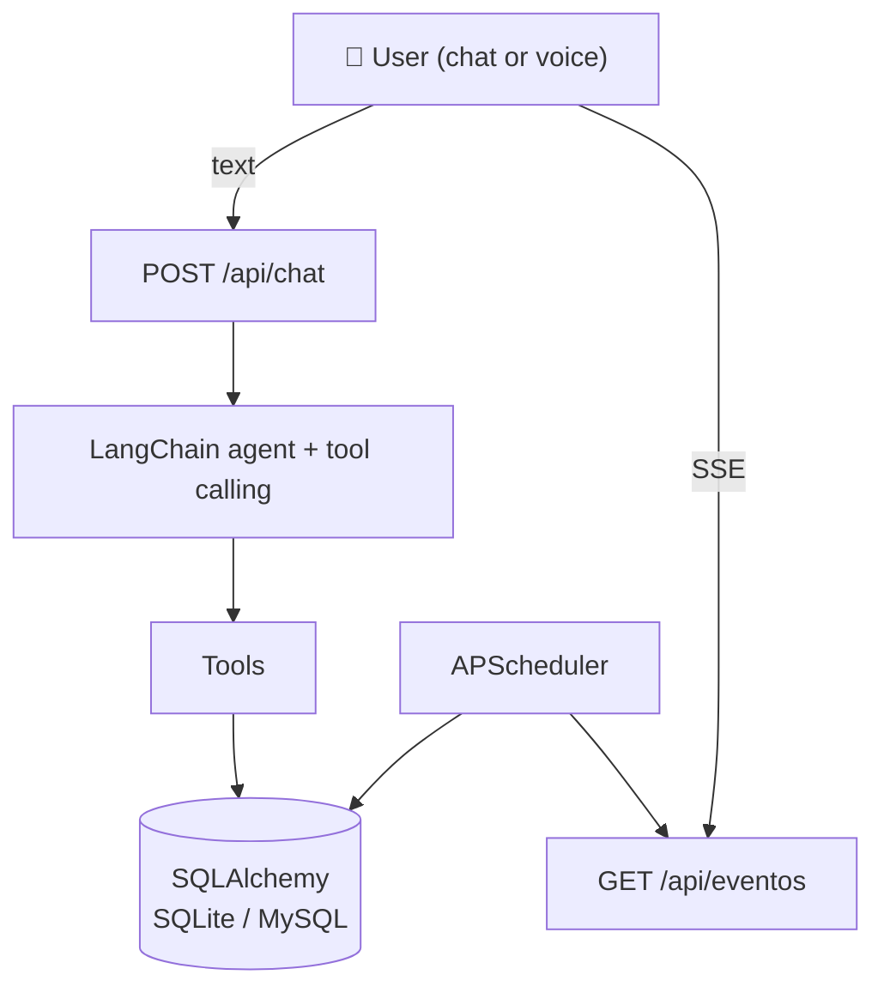

# Trackr

> **Your business, by voice or chat.**

Trackr is a web assistant for small businesses. Instead of clicking through forms, you talk or type to an AI agent that manages inventory, orders, customers, employees, and reminders.

- 💬 **Chat** – type instructions naturally.
- 🎙️ **Voice** *(Phase 2)* – record audio, get a Whisper transcript, confirm, and send.
- ⏰ **Reminders** – manual reminders and automatic low-stock alerts delivered over SSE.
- 📦 **Orders & inventory** – creating or delivering an order updates stock automatically.

**Current status:** Phase 1 — reminders, chat, sessions, scheduler, and SSE on SQLite.

---

## What it looks like

| You say / type | Trackr does |
|---|---|
| *"Recuérdame mañana a las 5 llamar al proveedor de empaques"* | Creates a reminder for that user at that time. |
| *"¿Qué recordatorios tengo pendientes?"* | Lists pending reminders. |
| *"¿Cuántas cajas medianas nos quedan?"* | *(Phase 3)* Checks stock. |
| *"El pedido 124 salió por paquetería, guía 998877"* | *(Phase 3)* Marks shipped and deducts stock. |

---

## Architecture



Core rules:

- The agent **never writes SQL**; it only calls tools.
- Writes that affect inventory or orders will require confirmation *(designed now, implemented in Phase 1.5)*.
- Nothing is hard-deleted; state changes keep an audit trail.
- Reminders are per-user and delivered only to their SSE channel.
- The scheduler claims due reminders atomically so multiple workers can never fire the same one.

---

## Tech stack

| Layer | Technology |
|---|---|
| Backend | Python 3.11+, FastAPI |
| Agent | LangChain + OpenAI-compatible API (OpenRouter by default) |
| ORM | SQLAlchemy 2.x |
| DB | SQLite (dev) → MySQL (prod) |
| Scheduler | APScheduler |
| Frontend | Plain HTML + JavaScript (SSE, MediaRecorder later) |
| Packaging | `uv` |

---

## Project structure

```
.
├── app/
│   ├── main.py                 # FastAPI entry point
│   ├── config.py               # Settings from .env
│   ├── api/
│   │   ├── auth.py             # login / logout / me
│   │   ├── chat.py             # POST /api/chat
│   │   └── eventos.py          # GET /api/eventos (SSE)
│   ├── agente/
│   │   ├── agente.py           # LangChain agent loop
│   │   └── tools/recordatorios.py
│   ├── db/
│   │   ├── base.py             # engine, session, Base
│   │   └── modelos.py          # SQLAlchemy models
│   ├── servicios/
│   │   ├── scheduler.py        # reminder firing job
│   │   └── event_queue.py      # per-user SSE queues
│   └── static/index.html       # minimal chat UI
├── scripts/
│   └── crear_usuario.py        # create the first user
├── tests/                      # pytest suite
├── pyproject.toml
├── uv.lock
├── .env.example
└── README.md
```

---

## Getting started

Requires [`uv`](https://docs.astral.sh/uv/).

```bash
# 1. Install dependencies
uv sync --group dev

# 2. Configure environment
cp .env.example .env
# Edit .env with your keys

# 3. Create the first user
uv run python -m scripts.crear_usuario

# 4. Run the server
uv run uvicorn app.main:app --reload --host 127.0.0.1
```

Open http://localhost:8000, log in, and chat.

Run tests:

```bash
uv run pytest -v
```

---

## Environment variables

| Variable | Default | Purpose |
|---|---|---|
| `OPENROUTER_API_KEY` | *(required)* | API key for the LLM provider. |
| `OPENROUTER_API_BASE_URL` | `https://openrouter.ai/api/v1` | Provider base URL. |
| `MODEL_AGENTE` | `openai/gpt-4o-mini` | Model ID. For OpenRouter use a full ID like `openai/gpt-4o-mini`. |
| `SECRET_KEY` | *(required)* | Secret for signed session cookies. |
| `DATABASE_URL` | `sqlite:///./dev.db` | SQLAlchemy DB URL. |
| `TIMEZONE` | `America/Monterrey` | Default timezone injected into the agent prompt. |
| `SCHEDULER_INTERVAL_SECONDS` | `10` | How often the scheduler checks due reminders. |
| `CHAT_RATE_LIMIT_PER_MINUTE` | `60` | Per-user chat rate limit. |

---

## API endpoints

| Method | Path | Description |
|---|---|---|
| `POST` | `/api/login` | Log in, sets session cookie. |
| `POST` | `/api/logout` | Clear session. |
| `GET`  | `/api/me` | Current user info. |
| `POST` | `/api/chat` | Send a text message to the agent. |
| `GET`  | `/api/eventos` | SSE stream for reminders. |

---

## Current data model

### `usuarios`
Employees / users. Hashed passwords, active flag.

### `recordatorios`
| Field | Notes |
|---|---|
| `usuario_id` | Owner; reminders are delivered only to this user. |
| `texto` | Reminder text. |
| `fecha_hora` | UTC internally, shown in the configured business timezone. |
| `estado` | `pendiente` → `vencido` → `visto` (or `cancelado`). |
| `visto_en` | When it was delivered to the UI. |

### `comandos_log`
Audit log of every user command, tool called, arguments, and result.

---

## Roadmap

### Phase 1 ✅
- [x] Chat endpoint + agent with `crear_recordatorio` and `listar_recordatorios`
- [x] Minimal chat UI with SSE reminder delivery
- [x] SQLite + SQLAlchemy persistence
- [x] Sessions and login
- [x] Atomic scheduler + SSE

### Phase 1.5 *(next)*
- [ ] Conversation memory per session
- [ ] Confirmation step for inventory/order writes
- [ ] Voice input with Whisper

### Phase 2
- [ ] MySQL support + Alembic migrations
- [ ] Limited DB user permissions

### Phase 3
- [ ] Products, customers, employees
- [ ] Inventory ledger (`movimientos_inventario`)
- [ ] Orders, shipping, and transactional stock deduction
- [ ] Automatic low-stock alerts

### Phase 4
- [ ] Authentication & roles
- [ ] Richer frontend (React or similar)
- [ ] Audit history UI
- [ ] Production deployment

---

## License


